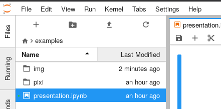

# pixijs-jupyter

Materials and examples originally presented at [PyData Berlin 2018](https://pydata.org/berlin2018/schedule/presentation/32/).

This repository was bootstrapped using the [Widget TypeScript Cookiecutter](https://github.com/jupyter-widgets/widget-ts-cookiecutter).

This is for demo purposes and is not meant to be installed from [pypi](https://pypi.org) and [npm](https://npmjs.org).


The last example demoed during the presentation is an interactive game state viewer, but has not been included in this repository since the original viewer has not been made public (yet!).

There is however a [quick video](https://www.youtube.com/watch?v=RGYFc-cz7nU) to give an idea of what it looks like to manipulate such widget in JupyterLab:

[](https://www.youtube.com/watch?v=RGYFc-cz7nU)

The presentation from PyData Berlin 2018 is also available on Youtube:

[](https://www.youtube.com/watch?v=TcuJILbTPZg)

## Run on Binder

The presentation from PyData Berlin 2018 is directly available on Binder, which means you can try it right away in your web browser!

[](https://mybinder.org/v2/gh/jtpio/pixijs-jupyter/pydata-berlin?urlpath=lab/tree/examples/presentation.ipynb)

Click on `presentation.ipynb` to view the notebook, or browse the files to look at the source code for the widgets.



## Run locally

The other option is to install all the dependencies and run it locally:

```bash
# Install the Python package
pip install -e .

# JupyterLab Manager is required for widgets
jupyter labextension install @jupyter-widgets/jupyterlab-manager

# Link the extension
# This will fetch all the dependencies from pypi and npm, and might take a while to finish.
jupyter labextension link .

# start JupyterLab
jupyter lab
```
